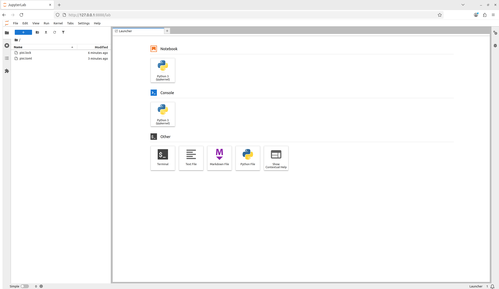

::: questions

* What is Pixi?
* How does Pixi enable fully reproducible software environments?
* What are Pixi's semantics?

:::

::: objectives

* Outline Pixi's workflow design
* Summarize the relationship between a Pixi manifest and a lock file
* Create a multi-platform and multi-environment Pixi workspace

:::

## Pixi

As described in the previous section on computational reproducibility, to have reproducible software environments we need tools that can take high level human writeable environment configuration files and produce machine-readable, digest-level lock files that exactly specify every piece of software that exists in an environment.

[Pixi](https://www.pixi.sh/) is a cross-platform package and environment manager that can handle complex development workflows.
Importantly, Pixi automatically and non-optionally will produce or update a lock file for the software environments defined by the user whenever any actions mutate the environment.
Pixi is written in Rust, and leverages the language's speed and technologies to solve environments fast.

Pixi addresses the concept of computational reproducibility by focusing on a set of main features:

1. **Virtual environment management**: Pixi can create environments that contain conda packages and Python packages and use or switch between environments easily.
1. **Package management**: Pixi enables the user to install, update, and remove packages from these environments through the `pixi` command line.
1. **Task management**: Pixi has a task runner system built-in, which allows for tasks with custom logic and dependencies on other tasks to be created.

It also combines these features with robust behaviors:

1. **Automatic lock files**: Any changes to a Pixi workspace that can mutate the environments defined in it will automatically and non-optionally result in the Pixi lock file for the workspace being updated.
This ensures that any and every state of a Pixi project is trivially computationally reproducible.
1. **Solving environments for other platforms**: Pixi allows the user to solve environment for platforms other than the current user machine's.
This allows for users to solve and share environment to any collaborator with confidence that all environments will work with no additional setup.
1. **Pairity of conda and Python packages**: Pixi allows for conda packages and Python packages to be used together seamlessly, and is unique in its ability to handle overlap in dependencies between them.
Pixi will first solve all conda package requirements for the target environment, lock the environment, and then solve all the dependencies of the Python packages for the environment, determine if there are any overlaps with the existing conda environment, and the only install the missing Python dependencies.
This ensures allows for fully reproducible solves and for the two package ecosystems to compliment each other rather than potentially cause conflicts.
1. **Efficient caching**: Pixi uses an extremely efficient global caching scheme.
This means that the first time a package is installed on a machine with Pixi is the slowest is will ever be to install it for any future project on the machine while the cache is still active.

## Project-based workflows

Pixi uses a "project-based" workflow which scopes a workspace and the installed tooling for a project to the project's directory tree.

**Pros**

* Environments in the workspace are isolated to the project and can not cause conflicts with any tools or projects outside of the project.
* A high level declarative syntax allows for users to state only what they need, making even complex environments easy to understand and share.
* Environments can be treated as transient and be fully deleted and then rebuilt within seconds without worry about breaking other projects.
This allows for much greater freedom of exploration and development without fear.

**Cons**

* As each project has its own version of its packages installed, and does not share a copy with other projects, the total amount of disk space on a machine can be larger than other forms of development workflows.
This can be mitigated for disk limited machines by cleaning environments not in use while keeping their lock files and cleaning the system cache periodically.
* Each project needs to be set up by itself and does not reuse components of previous projects.

## Pixi project files and the CLI API basics

Every Pixi project begins with creating a manifest file.
A manifest file is a declarative configuration file that list what the high level requirements of a project are.
Pixi then takes those requirements and constraints and solves for the full dependency tree.

Let's create our first Pixi project.
First, to have a uniform directory tree experience, clone the `pixi-cuda-lesson` GitHub repository (which you made as part of the setup) under your home directory on your machine and navigate to it.

```bash
cd ~
git clone git@github.com:<username>/pixi-cuda-lesson.git
cd ~/pixi-cuda-lesson
```

Then use `pixi init` to create a new project directory and initialize a Pixi manifest with your machine's configuration.

```bash
pixi init example
```

```output
Created /home/<username>/pixi-cuda-lesson/example/pixi.toml
```

Navigate to the `example` directory and check the directory structure

:::: group-tab

### Unix and Windows Terminal

```bash
cd example
ls -1ap
```

```output
./
../
.gitattributes
.gitignore
pixi.toml
```

### Windows PowerShell

```powershell
cd example
ls | fw -col 1
```

```output
.gitattributes
.gitignore
pixi.toml
```

::::

We see that Pixi  has setup Git configuration files for the project as well as a Pixi manifest `pixi.toml` file.
Checking the default manifest file, we see three TOML tables: `workspace`, `tasks`, and `dependencies`.

```bash
cat pixi.toml
```

```toml
[workspace]
authors = ["Your Name <your email from your global Git config>"]
channels = ["conda-forge"]
name = "example"
# This will be whatever your machine's platform is
platforms = ["linux-64"]
version = "0.1.0"

[tasks]

[dependencies]
```

* [`workspace`][workspace table]: Defines metadata and properties for the entire project.
* [`tasks`][task table]: Defines tasks for the task runner system to execute from the command line and their dependencies.
* [`dependencies`][dependencies table]: Defines the conda package dependencies from the `channels` in your `workspace` table.

::: callout

For the rest of the lesson we'll ignore the `authors` list in our discussions as it is optional and will be specific to you.

:::

At the moment there are no dependencies defined in the manifest, so let's add Python using the [`pixi add` CLI API](https://pixi.sh/latest/reference/cli/pixi/add/).

```bash
pixi add python
```

```output
✔ Added python >=3.13.5,<3.14
```

What happened?
We saw that `python` got added, and we can see that the `pixi.toml` manifest now contains `python` as a dependency

```bash
cat pixi.toml
```

```toml
[workspace]
channels = ["conda-forge"]
name = "example"
# This will be whatever your machine's platform is
platforms = ["linux-64"]
version = "0.1.0"

[tasks]

[dependencies]
python = ">=3.13.5,<3.14"
```

Further, we also now see that a `pixi.lock` lock file has been created in the project directory as well as a `.pixi/` directory.

:::: group-tab

### Unix and Windows Terminal

```bash
ls -1ap
```

```output
./
../
.gitattributes
.gitignore
.pixi/
pixi.lock
pixi.toml
```

### Windows PowerShell

```powershell
ls | fw -col 1
```

```output
.pixi
.gitattributes
.gitignore
pixi.lock
pixi.toml
```
::::

The `.pixi/` directory contains the installed environments.
We can see that at the moment there is just one environment named `default`

:::: group-tab

### Unix and Windows Terminal

```bash
ls -1p .pixi/envs/
```
```output
default/
```

### Windows PowerShell

```powershell
ls .pixi\envs | fw -col 1
```
```output
default
```
::::

Inside the `.pixi/envs/default/` directory are all the libraries, header files, and executables that are needed by the environment.

The `pixi.lock` lock file is a YAML file that contains two definition groups: `environments` and `packages`.
The `environments` group lists every environment in the workspace for every platform with a complete listing of all packages in the environment.
The `packages` group lists a full definition of every package that appears in the `environments` lists, including the package's URL on the conda package index and digests (e.g. sha256, md5).

Here's an example of what the `environments` and `packages` groups look like in the `pixi.toml` file we created for a `linux-64` platform machine.

```
version: 6
environments:
  default:
    channels:
    - url: https://conda.anaconda.org/conda-forge/
    packages:
      linux-64:

...

      - conda: https://conda.anaconda.org/conda-forge/linux-64/python-3.13.5-hec9711d_102_cp313.conda
      - conda: https://conda.anaconda.org/conda-forge/noarch/python_abi-3.13-8_cp313.conda
      - conda: https://conda.anaconda.org/conda-forge/linux-64/readline-8.2-h8c095d6_2.conda
      - conda: https://conda.anaconda.org/conda-forge/linux-64/tk-8.6.13-noxft_hd72426e_102.conda
      - conda: https://conda.anaconda.org/conda-forge/noarch/tzdata-2025b-h78e105d_0.conda
...

packages:

...

- conda: https://conda.anaconda.org/conda-forge/linux-64/python-3.13.5-hec9711d_102_cp313.conda
  build_number: 102
  sha256: c2cdcc98ea3cbf78240624e4077e164dc9d5588eefb044b4097c3df54d24d504
  md5: 89e07d92cf50743886f41638d58c4328
  depends:
  - __glibc >=2.17,<3.0.a0
  - bzip2 >=1.0.8,<2.0a0
  - ld_impl_linux-64 >=2.36.1
  - libexpat >=2.7.0,<3.0a0
  - libffi >=3.4.6,<3.5.0a0
  - libgcc >=13
  - liblzma >=5.8.1,<6.0a0
  - libmpdec >=4.0.0,<5.0a0
  - libsqlite >=3.50.1,<4.0a0
  - libuuid >=2.38.1,<3.0a0
  - libzlib >=1.3.1,<2.0a0
  - ncurses >=6.5,<7.0a0
  - openssl >=3.5.0,<4.0a0
  - python_abi 3.13.* *_cp313
  - readline >=8.2,<9.0a0
  - tk >=8.6.13,<8.7.0a0
  - tzdata
  license: Python-2.0
  size: 33273132
  timestamp: 1750064035176
  python_site_packages_path: lib/python3.13/site-packages

...
```

These groups provide a full description of every package described in the Pixi workspace and its dependencies and constraints on other packages.
This means that for each package specified, that version, and **only** that version, will be downloaded and installed in the future.

We can even test that now by deleting the installed environment fully with [`pixi clean`](https://pixi.sh/latest/reference/cli/pixi/clean/) and then getting it back (bit for bit) in a few seconds with [`pixi install`](https://pixi.sh/latest/reference/cli/pixi/install/).

```bash
pixi clean
```
```output
  removed /home/<username>/pixi-cuda-lesson/example/.pixi/envs
```
```bash
 pixi install
```
```output
✔ The default environment has been installed.
```

We can also see all the packages that were installed and are now available for us to use with [`pixi list`](https://pixi.sh/latest/reference/cli/pixi/list/)

::: tab

### Linux

```bash
pixi list
```
```output
Package           Version    Build               Size       Kind   Source
_libgcc_mutex     0.1       conda_forge         2.5 KiB    conda  https://conda.anaconda.org/conda-forge/
_openmp_mutex     4.5       2_gnu               23.1 KiB   conda  https://conda.anaconda.org/conda-forge/
bzip2             1.0.8     h4bc722e_7          246.9 KiB  conda  https://conda.anaconda.org/conda-forge/
ca-certificates   2025.8.3  hbd8a1cb_0          150.8 KiB  conda  https://conda.anaconda.org/conda-forge/
ld_impl_linux-64  2.44      h1423503_1          660.2 KiB  conda  https://conda.anaconda.org/conda-forge/
libexpat          2.7.1     hecca717_0          73.1 KiB   conda  https://conda.anaconda.org/conda-forge/
libffi            3.4.6     h2dba641_1          56.1 KiB   conda  https://conda.anaconda.org/conda-forge/
libgcc            15.1.0    h767d61c_4          804.8 KiB  conda  https://conda.anaconda.org/conda-forge/
libgcc-ng         15.1.0    h69a702a_4          28.6 KiB   conda  https://conda.anaconda.org/conda-forge/
libgomp           15.1.0    h767d61c_4          436.8 KiB  conda  https://conda.anaconda.org/conda-forge/
liblzma           5.8.1     hb9d3cd8_2          110.2 KiB  conda  https://conda.anaconda.org/conda-forge/
libmpdec          4.0.0     hb9d3cd8_0          89 KiB     conda  https://conda.anaconda.org/conda-forge/
libsqlite         3.50.4    h0c1763c_0          910.7 KiB  conda  https://conda.anaconda.org/conda-forge/
libuuid           2.38.1    h0b41bf4_0          32.8 KiB   conda  https://conda.anaconda.org/conda-forge/
libzlib           1.3.1     hb9d3cd8_2          59.5 KiB   conda  https://conda.anaconda.org/conda-forge/
ncurses           6.5       h2d0b736_3          870.7 KiB  conda  https://conda.anaconda.org/conda-forge/
openssl           3.5.2     h26f9b46_0          3 MiB      conda  https://conda.anaconda.org/conda-forge/
python            3.13.5    hec9711d_102_cp313  31.7 MiB   conda  https://conda.anaconda.org/conda-forge/
python_abi        3.13      8_cp313             6.8 KiB    conda  https://conda.anaconda.org/conda-forge/
readline          8.2       h8c095d6_2          275.9 KiB  conda  https://conda.anaconda.org/conda-forge/
tk                8.6.13    noxft_hd72426e_102  3.1 MiB    conda  https://conda.anaconda.org/conda-forge/
tzdata            2025b     h78e105d_0          120.1 KiB  conda  https://conda.anaconda.org/conda-forge/
```

### macOS

```bash
pixi list
```
```output
Package          Version   Build               Size       Kind   Source
bzip2            1.0.8     h99b78c6_7          120 KiB    conda  https://conda.anaconda.org/conda-forge/
ca-certificates  2025.8.3  hbd8a1cb_0          150.8 KiB  conda  https://conda.anaconda.org/conda-forge/
icu              75.1      hfee45f7_0          11.3 MiB   conda  https://conda.anaconda.org/conda-forge/
libexpat         2.7.1     hec049ff_0          64.4 KiB   conda  https://conda.anaconda.org/conda-forge/
libffi           3.4.6     h1da3d7d_1          38.9 KiB   conda  https://conda.anaconda.org/conda-forge/
liblzma          5.8.1     h39f12f2_2          90.1 KiB   conda  https://conda.anaconda.org/conda-forge/
libmpdec         4.0.0     h5505292_0          70.1 KiB   conda  https://conda.anaconda.org/conda-forge/
libsqlite        3.50.4    h4237e3c_0          881.5 KiB  conda  https://conda.anaconda.org/conda-forge/
libzlib          1.3.1     h8359307_2          45.3 KiB   conda  https://conda.anaconda.org/conda-forge/
ncurses          6.5       h5e97a16_3          778.3 KiB  conda  https://conda.anaconda.org/conda-forge/
openssl          3.5.2     he92f556_0          2.9 MiB    conda  https://conda.anaconda.org/conda-forge/
python           3.13.5    hf3f3da0_102_cp313  12.3 MiB   conda  https://conda.anaconda.org/conda-forge/
python_abi       3.13      8_cp313             6.8 KiB    conda  https://conda.anaconda.org/conda-forge/
readline         8.2       h1d1bf99_2          246.4 KiB  conda  https://conda.anaconda.org/conda-forge/
tk               8.6.13    h892fb3f_2          3 MiB      conda  https://conda.anaconda.org/conda-forge/
tzdata           2025b     h78e105d_0          120.1 KiB  conda  https://conda.anaconda.org/conda-forge/
```

### Windows

```bash
pixi list
```
```output
Package          Version       Build               Size       Kind   Source
bzip2            1.0.8         h2466b09_7          53.6 KiB   conda  https://conda.anaconda.org/conda-forge/
ca-certificates  2025.8.3      h4c7d964_0          150.9 KiB  conda  https://conda.anaconda.org/conda-forge/
libexpat         2.7.1         hac47afa_0          138 KiB    conda  https://conda.anaconda.org/conda-forge/
libffi           3.4.6         h537db12_1          43.9 KiB   conda  https://conda.anaconda.org/conda-forge/
liblzma          5.8.1         h2466b09_2          102.5 KiB  conda  https://conda.anaconda.org/conda-forge/
libmpdec         4.0.0         h2466b09_0          86.6 KiB   conda  https://conda.anaconda.org/conda-forge/
libsqlite        3.50.4        hf5d6505_0          1.2 MiB    conda  https://conda.anaconda.org/conda-forge/
libzlib          1.3.1         h2466b09_2          54.2 KiB   conda  https://conda.anaconda.org/conda-forge/
openssl          3.5.2         h725018a_0          8.8 MiB    conda  https://conda.anaconda.org/conda-forge/
python           3.13.5        h7de537c_102_cp313  16 MiB     conda  https://conda.anaconda.org/conda-forge/
python_abi       3.13          8_cp313             6.8 KiB    conda  https://conda.anaconda.org/conda-forge/
tk               8.6.13        h2c6b04d_2          3.3 MiB    conda  https://conda.anaconda.org/conda-forge/
tzdata           2025b         h78e105d_0          120.1 KiB  conda  https://conda.anaconda.org/conda-forge/
ucrt             10.0.22621.0  h57928b3_1          546.6 KiB  conda  https://conda.anaconda.org/conda-forge/
vc               14.3          h41ae7f8_31         17.8 KiB   conda  https://conda.anaconda.org/conda-forge/
vc14_runtime     14.44.35208   h818238b_31         666.4 KiB  conda  https://conda.anaconda.org/conda-forge/
vcomp14          14.44.35208   h818238b_31         111.3 KiB  conda  https://conda.anaconda.org/conda-forge/
```
:::

::: challenge

## Extending the manifest

Let's extend this manifest to add the Python library `numpy` and the Jupyter tools `notebook` and `jupyterlab` as dependencies and add a [task](https://pixi.sh/latest/workspace/advanced_tasks/) called `lab` that will launch Jupyter Lab in the current working directory.

Hint: Look at the Pixi manifest table structure to think how a `task` might be added.
It is fine to read the docs too!

::: solution

Let's start at the command line and add the additional dependencies with `pixi add`

```bash
pixi add numpy notebook jupyterlab
```

We can manually edit the `pixi.toml` with a text editor to add a task named `lab` that when called executes `jupyter lab`.
This is sometimes the easiest thing to do, but we can also use the `pixi` CLI.

```bash
pixi task add lab "jupyter lab" --description "Launch JupyterLab"
```
```output
✔ Added task `lab`: jupyter lab, description = "Launch JupyterLab"
```

The resulting `pixi.toml` manifest is

:::: group-tab

### Manually edited

```toml
[workspace]
channels = ["conda-forge"]
name = "example"
platforms = ["linux-64"]
version = "0.1.0"

[tasks.lab]
description = "Launch JupyterLab"
cmd = "jupyter lab"

[dependencies]
python = ">=3.13.5,<3.14"
numpy = ">=2.3.2,<3"
notebook = ">=7.4.5,<8"
jupyterlab = ">=4.4.5,<5"
```

### `pixi task` CLI

```toml
[workspace]
channels = ["conda-forge"]
name = "example"
platforms = ["linux-64"]
version = "0.1.0"

[tasks]
lab = { cmd = "jupyter lab", description = "Launch JupyterLab" }

[dependencies]
python = ">=3.13.5,<3.14"
numpy = ">=2.3.2,<3"
notebook = ">=7.4.5,<8"
jupyterlab = ">=4.4.5,<5"
```

::::
:::
:::

With our new dependencies added to the project manifest and our `lab` task defined, let's use all of them together by launching our task using [`pixi run`](https://pixi.sh/latest/reference/cli/pixi/run/)

```bash
pixi run lab
```

and we see that Jupyter Lab launches!

{
alt='The view of the Jupyter Lab interface in a web browser.'
width='100%'
}

::: challenge

## Adding the canonical Pixi `start` task

For Pixi projects, it is canonical to have a `start` task so that for any Pixi project a user can navigate to the top level directory of a project run

```bash
pixi run start
```

and begin to explore the project.
Add a task called `start` that [depends-on](https://pixi.sh/latest/workspace/advanced_tasks/#depends-on) the `lab` task.

::: solution

Using the command line, we use the same `pixi task` syntax as before, but now with the `--depends-on` option

```bash
pixi task add --depends-on lab --description "Start exploring the Pixi project" start ''
```
```output
✔ Added task `start`: , depends-on = 'lab', description = "Start exploring the Pixi project"
```

:::: group-tab

### Manually edited

```toml
[workspace]
channels = ["conda-forge"]
name = "example"
platforms = ["linux-64"]
version = "0.1.0"

[tasks.lab]
description = "Launch JupyterLab"
cmd = "jupyter lab"

[tasks.start]
description = "Start exploring the Pixi project"
depends-on = ["lab"]

[dependencies]
python = ">=3.13.5,<3.14"
numpy = ">=2.3.2,<3"
notebook = ">=7.4.5,<8"
jupyterlab = ">=4.4.5,<5"
```

### `pixi task` CLI

```toml
[workspace]
channels = ["conda-forge"]
name = "example"
platforms = ["linux-64"]
version = "0.1.0"

[tasks]
lab = { cmd = "jupyter lab", description = "Launch JupyterLab" }
start = { depends-on = [{ task = "lab" }], description = "Start exploring the Pixi project" }

[dependencies]
python = ">=3.13.5,<3.14"
numpy = ">=2.3.2,<3"
notebook = ">=7.4.5,<8"
jupyterlab = ">=4.4.5,<5"
```
::::

:::
:::

::: testimonial

## Task overview

A user can also run `pixi task list` to get a summary of the tasks that are available to them in the workspace.

```bash
pixi task list
```
```output
Tasks that can run on this machine:
-----------------------------------
lab, start
Task   Description
lab    Launch JupyterLab
start  Start exploring the Pixi project
```

:::

Here we used [`pixi run`](https://pixi.sh/latest/reference/cli/pixi/run/) to execute tasks in the workspace's environments without ever explicitly activating the environment.
This is a different behavior compared to tools like conda of Python virtual environments, where the assumption is that you have activated an environment before using it.
With Pixi we can do the equivalent with [`pixi shell`](https://pixi.sh/latest/reference/cli/pixi/shell/), which starts a subshell in the current working directory with the Pixi environment activated.

```bash
pixi shell
```

Notice how your shell prompt now has `(example)` (the workspace name) preceding it, signaling to you that you're in the activated environment.
You can now directly run commands that use the environment.

```bash
python
```
```output
Python 3.13.5 | packaged by conda-forge | (main, Jun 16 2025, 08:27:50) [GCC 13.3.0] on linux
Type "help", "copyright", "credits" or "license" for more information.
>>>
```

As we're in a subshell, to exit the environment and move back to the shell that launched the subshell, just `exit` the shell.

```bash
exit
```

::: challenge

## Multi platform projects

Extend your project to additionally support the `linux-64`, `osx-arm64`, and `win-64` platforms.

::: solution

Using the [`pixi workspace` CLI API](https://pixi.sh/latest/reference/cli/pixi/workspace/), one can add the platforms with

```bash
pixi workspace platform add linux-64 osx-arm64 win-64
```
```output
✔ Added linux-64
✔ Added osx-arm64
✔ Added win-64
```

This both adds the platforms to the `workspace` `platforms` list and solves for the platforms and updates the lock file!

One can also manually edit the `pixi.toml` with a text editor to add the desired platforms to the `platforms` list.

The resulting `pixi.toml` manifest is

```toml
[workspace]
channels = ["conda-forge"]
name = "example"
platforms = ["linux-64", "osx-arm64", "win-64"]
version = "0.1.0"

[tasks.lab]
description = "Launch JupyterLab"
cmd = "jupyter lab"

[tasks.start]
description = "Start exploring the Pixi project"
depends-on = ["lab"]

[dependencies]
python = ">=3.13.5,<3.14"
numpy = ">=2.3.2,<3"
notebook = ">=7.4.5,<8"
jupyterlab = ">=4.4.5,<5"
```
:::
:::

::: callout

# Pixi features

"[Features](https://pixi.sh/latest/reference/pixi_manifest/#the-feature-and-environments-tables)" in Pixi are TOML tables that define a _part_ of an environment, but by itself is not useable.
Features can be composed together to create an environment &mdash; think of how individual LEGO bricks (features) can be connected together to build a larger structure (an environment).
Features can also be used across multiple environments, which allows for building complex environment structures without having to redefine sections.

Pseudo-example: The following Pixi manifest structure defines three "features" (`A`, `B`, and `C`) and then constructs four different environments (`A`, `two`, `three`, `alternative`) by composing the features together.

```toml
...

[feature.A.dependencies]
...

[feature.B.dependencies]
...

[feature.C.dependencies]
...

[environments]
A = ["A"]
two = ["A", "C"]
three = ["A", "B", "C"]
alternative = ["B", "A"]
```

:::

So far the Pixi project has only had one environment defined in it.
We can make the [project multi-environment](https://pixi.sh/latest/workspace/multi_environment/) by first defining a new ["feature"][feature table] which provides all the fields necessary to define _part_ of an environment to extend the `default` environment.
We can create a new `feature` named `dev` and then create an `environment` also named `dev` which uses the `dev` feature to extend the default environment

```toml
[workspace]
channels = ["conda-forge"]
name = "example"
platforms = ["linux-64", "osx-arm64", "win-64"]
version = "0.1.0"

[tasks.lab]
description = "Launch JupyterLab"
cmd = "jupyter lab"

[tasks.start]
description = "Start exploring the Pixi project"
depends-on = ["lab"]

[dependencies]
python = ">=3.13.5,<3.14"
numpy = ">=2.3.0,<3"
notebook = ">=7.4.3,<8"
jupyterlab = ">=4.4.3,<5"

[feature.dev.dependencies]

[environments]
dev = ["dev"]
```

We can now add `pre-commit` to the `dev` feature's `dependencies` and have it be accessible in the `dev` environment.

```bash
pixi add --feature dev pre-commit
```
```output
✔ Added pre-commit >=4.2.0,<5
Added these only for feature: dev
```

```toml
[workspace]
channels = ["conda-forge"]
name = "example"
platforms = ["linux-64", "osx-arm64", "win-64"]
version = "0.1.0"

[tasks.lab]
description = "Launch JupyterLab"
cmd = "jupyter lab"

[tasks.start]
description = "Start exploring the Pixi project"
depends-on = ["lab"]

[dependencies]
python = ">=3.13.5,<3.14"
numpy = ">=2.3.2,<3"
notebook = ">=7.4.5,<8"
jupyterlab = ">=4.4.5,<5"

[feature.dev.dependencies]
pre-commit = ">=4.3.0,<5"

[environments]
dev = ["dev"]
```

This now allows us to specify the environment we want tasks to run in with the `--environment` flag

```bash
pixi run --environment dev pre-commit --help
```
```bash
pixi shell --environment dev
```

::: callout

The `pixi workspace` CLI can also be used to add existing features to environments, but a feature needs to be defined before it can be added to the manifest

```bash
pixi add --feature dev pre-commit
pixi workspace environment add --feature dev dev
pixi upgrade --feature dev pre-commit
```

:::

## Global Tools

With the [`pixi global` CLI API](https://pixi.sh/dev/reference/cli/pixi/global/), users can manage globally installed tools in a way that makes them available from any directory on their machine.

As an example, we can install the [`bat`](https://github.com/sharkdp/bat) program &mdash; a `cat` clone with syntax highlighting and Git integration &mdash; as a global utility from conda-forge using [`pixi global`](https://pixi.sh/latest/global_tools/introduction/).

```bash
pixi global install bat
```
```output
└── bat: 0.25.0 (installed)
    └─ exposes: bat
```

Pixi has now installed `bat` for us in a custom environment under `~/.pixi/envs/bat/` and then exposed the `bat` command globally by placing `bat` on our shell's `PATH` at `~/.pixi/bin/bat`.
This now means that for any new terminal shell we open, `bat` will be available to use.

Using `pixi global` has also created a `~/.pixi/manifests/pixi-global.toml` file that tracks all of the software that is globally installed by Pixi

```toml
version = 1

[envs.bat]
channels = ["conda-forge"]
dependencies = { bat = "*" }
exposed = { bat = "bat" }
```

As new software is added to the system with `pixi global` this global manifest is updated.
If the global manifest is updated manually, the next time `pixi global update` is run, the environments defined in the global manifest will be installed on the system.
This means that by sharing a Pixi global manifest, a new machine can be provisioned with an entire suite of command line tools in seconds.

::: callout

## Version controlling our examples

As part of this lesson, we are building up a Git repository of the examples that we move through.
On a **new branch** in your repository, add and commit the files from the this episode.

```bash
git add pixi.* .git*
git commit
```

Then push your branch to your remote on GitHub

```bash
git push -u origin HEAD
```

and make a pull request to merge your changes into your remote's default branch.

We'll follow this pattern for every episode:
* Create a new feature branch
* Add and commit work to a pull request as we go
* Merge the pull request at the end

:::

::: keypoints

* Pixi uses a project based workflow and a declarative project manifest file to define project operations.
* Pixi automatically creates or updates a hash level lock file anytime the project manifest or dependencies are mutated.
* Pixi allows for multi-platform and multi-environment projects to be defined in a single project manifest and be fully described in a single lock file.

:::

[workspace table]: https://pixi.sh/latest/reference/pixi_manifest/#the-workspace-table
[task table]: https://pixi.sh/latest/reference/pixi_manifest/#the-tasks-table
[dependencies table]: https://pixi.sh/latest/reference/pixi_manifest/#the-dependencies-tables
[feature table]: https://pixi.sh/latest/reference/pixi_manifest/#the-feature-table
